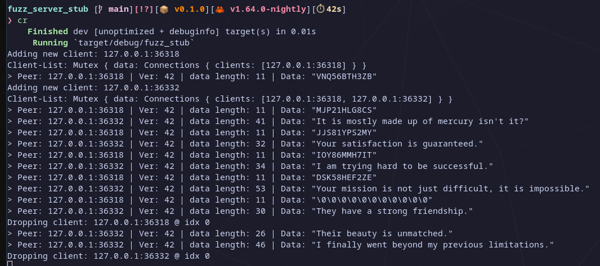

## Readme

Quick PoC of a fuzzing server stub written in Rust.
The server opens a TCP connection on `localhost:5555` and asynchronously handles incoming connections.
The incoming client payloads are currently expected to be in a sane form of:

```
[protocol_version:u8][data_length:u16][data:<data_length>]
```

The server does some basic (de-)serialization of each incoming packet before distributing valid packets to all connected clients, except the one from which the packet was received


### Demo

